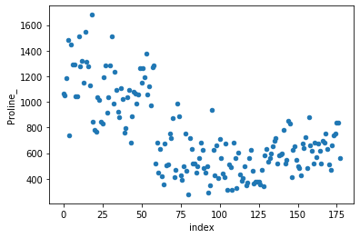

```python
import pandas as pd
import numpy as np
import matplotlib.pyplot as plt
from sklearn.svm import SVC
import seaborn as sns
from sklearn.cluster import KMeans
%matplotlib inline
```


```python
pwd
```


    'C:\\Users\\cloa\\Downloads\\Day8_IntrotoML_Project\\Day8_IntrotoML_Project\\UCIMLR\\Wine'


```python
df = pd.read_csv("wine.csv", header = 0, sep = ",")
```


```python
df.columns = df.columns.str.replace(' ', '_')
df.columns = df.columns.str.replace('OD280/OD315_of_diluted_wines', 'OD280')
```


```python
df.head()
```


<div>
<style scoped>
    .dataframe tbody tr th:only-of-type {
        vertical-align: middle;
    }

    .dataframe tbody tr th {
        vertical-align: top;
    }

    .dataframe thead th {
        text-align: right;
    }
</style>
<table border="1" class="dataframe">
  <thead>
    <tr style="text-align: right;">
      <th></th>
      <th>Alchohol</th>
      <th>Malic_Acid</th>
      <th>Ash</th>
      <th>Alcalinity_of_ash</th>
      <th>Magnesium</th>
      <th>Total_Phenols</th>
      <th>Flavinoids</th>
      <th>Nonflavanoid_phenols</th>
      <th>Proanthocyanins</th>
      <th>Color_intensity</th>
      <th>Hue</th>
      <th>OD280</th>
      <th>Proline_</th>
      <th>Wine_Class</th>
      <th>target_n</th>
    </tr>
  </thead>
  <tbody>
    <tr>
      <th>0</th>
      <td>14.23</td>
      <td>1.71</td>
      <td>2.43</td>
      <td>15.6</td>
      <td>127</td>
      <td>2.80</td>
      <td>3.06</td>
      <td>0.28</td>
      <td>2.29</td>
      <td>5.64</td>
      <td>1.04</td>
      <td>3.92</td>
      <td>1065</td>
      <td>0</td>
      <td>0</td>
    </tr>
    <tr>
      <th>1</th>
      <td>13.20</td>
      <td>1.78</td>
      <td>2.14</td>
      <td>11.2</td>
      <td>100</td>
      <td>2.65</td>
      <td>2.76</td>
      <td>0.26</td>
      <td>1.28</td>
      <td>4.38</td>
      <td>1.05</td>
      <td>3.40</td>
      <td>1050</td>
      <td>0</td>
      <td>0</td>
    </tr>
    <tr>
      <th>2</th>
      <td>13.16</td>
      <td>2.36</td>
      <td>2.67</td>
      <td>18.6</td>
      <td>101</td>
      <td>2.80</td>
      <td>3.24</td>
      <td>0.30</td>
      <td>2.81</td>
      <td>5.68</td>
      <td>1.03</td>
      <td>3.17</td>
      <td>1185</td>
      <td>0</td>
      <td>0</td>
    </tr>
    <tr>
      <th>3</th>
      <td>14.37</td>
      <td>1.95</td>
      <td>2.50</td>
      <td>16.8</td>
      <td>113</td>
      <td>3.85</td>
      <td>3.49</td>
      <td>0.24</td>
      <td>2.18</td>
      <td>7.80</td>
      <td>0.86</td>
      <td>3.45</td>
      <td>1480</td>
      <td>0</td>
      <td>0</td>
    </tr>
    <tr>
      <th>4</th>
      <td>13.24</td>
      <td>2.59</td>
      <td>2.87</td>
      <td>21.0</td>
      <td>118</td>
      <td>2.80</td>
      <td>2.69</td>
      <td>0.39</td>
      <td>1.82</td>
      <td>4.32</td>
      <td>1.04</td>
      <td>2.93</td>
      <td>735</td>
      <td>0</td>
      <td>0</td>
    </tr>
  </tbody>
</table>
</div>


```python
df.info()
```

    <class 'pandas.core.frame.DataFrame'>
    RangeIndex: 178 entries, 0 to 177
    Data columns (total 14 columns):
     #   Column                        Non-Null Count  Dtype  
    ---  ------                        --------------  -----  
     0   Alchohol                      178 non-null    float64
     1   Malic_Acid                    178 non-null    float64
     2   Ash                           178 non-null    float64
     3   Alcalinity_of_ash             178 non-null    float64
     4   Magnesium                     178 non-null    int64  
     5   Total_Phenols                 178 non-null    float64
     6   Flavinoids                    178 non-null    float64
     7   Nonflavanoid_phenols          178 non-null    float64
     8   Proanthocyanins               178 non-null    float64
     9   Color_intensity               178 non-null    float64
     10  Hue                           178 non-null    float64
     11  OD280/OD315_of_diluted_wines  178 non-null    float64
     12  Proline_                      178 non-null    int64  
     13  Wine_Class                    178 non-null    int64  
    dtypes: float64(11), int64(3)
    memory usage: 19.6 KB
    


```python
df.reset_index().plot(kind='scatter', x='index', y='Wine_Class')
df.reset_index().plot(kind='scatter', x='index', y='Alchohol')
df.reset_index().plot(kind='scatter', x='index', y='Malic_Acid')
df.reset_index().plot(kind='scatter', x='index', y='Ash')
df.reset_index().plot(kind='scatter', x='index', y='Alcalinity_of_ash')
df.reset_index().plot(kind='scatter', x='index', y='Magnesium')
df.reset_index().plot(kind='scatter', x='index', y='Total_Phenols')
df.reset_index().plot(kind='scatter', x='index', y='Flavinoids')
df.reset_index().plot(kind='scatter', x='index', y='Nonflavanoid_phenols')
df.reset_index().plot(kind='scatter', x='index', y='Proanthocyanins')
df.reset_index().plot(kind='scatter', x='index', y='Color_intensity')
df.reset_index().plot(kind='scatter', x='index', y='Hue')
df.reset_index().plot(kind='scatter', x='index', y='OD280')
df.reset_index().plot(kind='scatter', x='index', y='Proline_')
```


    <matplotlib.axes._subplots.AxesSubplot at 0x1ab0935c108>





```python
g = sns.pairplot(df, hue='Wine_Class');
```


```python

```


    <seaborn.axisgrid.PairGrid at 0x1ab78247b48>


```python
training_points=df.iloc[:,:13]
labels=df.iloc[:, 13:]
```


```python
classifier=SVC(kernel='linear')
classifier.fit(training_points, labels)
```

    C:\Users\cloa\anaconda3\lib\site-packages\sklearn\utils\validation.py:760: DataConversionWarning: A column-vector y was passed when a 1d array was expected. Please change the shape of y to (n_samples, ), for example using ravel().
      y = column_or_1d(y, warn=True)
    


    SVC(C=1.0, break_ties=False, cache_size=200, class_weight=None, coef0=0.0,
        decision_function_shape='ovr', degree=3, gamma='scale', kernel='linear',
        max_iter=-1, probability=False, random_state=None, shrinking=True,
        tol=0.001, verbose=False)


```python
print(classifier.predict(df.iloc[100:125, :13].values))
```

    [1 1 1 1 1 1 1 1 1 1 1 1 1 1 1 1 1 1 1 1 1 1 1 1 1]
    


```python
labels.values.ravel()
```


    array([0, 0, 0, 0, 0, 0, 0, 0, 0, 0, 0, 0, 0, 0, 0, 0, 0, 0, 0, 0, 0, 0,
           0, 0, 0, 0, 0, 0, 0, 0, 0, 0, 0, 0, 0, 0, 0, 0, 0, 0, 0, 0, 0, 0,
           0, 0, 0, 0, 0, 0, 0, 0, 0, 0, 0, 0, 0, 0, 0, 1, 1, 1, 1, 1, 1, 1,
           1, 1, 1, 1, 1, 1, 1, 1, 1, 1, 1, 1, 1, 1, 1, 1, 1, 1, 1, 1, 1, 1,
           1, 1, 1, 1, 1, 1, 1, 1, 1, 1, 1, 1, 1, 1, 1, 1, 1, 1, 1, 1, 1, 1,
           1, 1, 1, 1, 1, 1, 1, 1, 1, 1, 1, 1, 1, 1, 1, 1, 1, 1, 1, 1, 2, 2,
           2, 2, 2, 2, 2, 2, 2, 2, 2, 2, 2, 2, 2, 2, 2, 2, 2, 2, 2, 2, 2, 2,
           2, 2, 2, 2, 2, 2, 2, 2, 2, 2, 2, 2, 2, 2, 2, 2, 2, 2, 2, 2, 2, 2,
           2, 2], dtype=int64)


```python
labels.values.shape
```


    (178, 1)


```python
labels.values.ravel().shape
```


    (178,)


```python
classifier.predict(df.iloc[:, :13].values)
```


    array([0, 0, 0, 0, 0, 0, 0, 0, 0, 0, 0, 0, 0, 0, 0, 0, 0, 0, 0, 0, 0, 0,
           0, 0, 0, 0, 0, 0, 0, 0, 0, 0, 0, 0, 0, 0, 0, 0, 0, 0, 0, 0, 0, 0,
           0, 0, 0, 0, 0, 0, 0, 0, 0, 0, 0, 0, 0, 0, 0, 1, 1, 2, 1, 1, 1, 1,
           1, 1, 1, 1, 1, 1, 1, 1, 1, 1, 1, 1, 1, 1, 1, 1, 1, 1, 1, 1, 1, 1,
           1, 1, 1, 1, 1, 1, 1, 1, 1, 1, 1, 1, 1, 1, 1, 1, 1, 1, 1, 1, 1, 1,
           1, 1, 1, 1, 1, 1, 1, 1, 1, 1, 1, 1, 1, 1, 1, 1, 1, 1, 1, 1, 2, 2,
           2, 2, 2, 2, 2, 2, 2, 2, 2, 2, 2, 2, 2, 2, 2, 2, 2, 2, 2, 2, 2, 2,
           2, 2, 2, 2, 2, 2, 2, 2, 2, 2, 2, 2, 2, 2, 2, 2, 2, 2, 2, 2, 2, 2,
           2, 2], dtype=int64)


```python
pred = classifier.predict(df.iloc[:, :13].values)
gt = labels.values.ravel()
```


```python
sum(pred == gt) / len(pred) * 100
```


    99.43820224719101


```python
df['target_n'] = df['Wine_Class']
X = df[['Alchohol', 'OD280', 'Flavinoids', 'Hue' ]]
km = KMeans(3, init = 'random')
km.fit(X)
```


    KMeans(algorithm='auto', copy_x=True, init='random', max_iter=300, n_clusters=3,
           n_init=10, n_jobs=None, precompute_distances='auto', random_state=None,
           tol=0.0001, verbose=0)


```python
centers = km.cluster_centers_
centers
```


    array([[13.09701754,  1.72438596,  0.85947368,  0.73168421],
           [13.67921875,  3.16171875,  3.02203125,  1.06125   ],
           [12.1422807 ,  2.88140351,  2.08438596,  1.06666667]])


```python
plt.figure(figsize = (14,6))
plt.subplot(121)
plt.scatter(df.Alchohol, df.OD280, c=df['target_n'])
plt.xlabel('Alchohol')
plt.ylabel('OD280')
plt.title('True Labels')

plt.subplot(122)
plt.scatter(df.Alchohol, df.OD280, c=km.labels_)
plt.scatter(centers[:,0], centers[:,2], marker='o', c='r', s=100)
plt.xlabel('Alchohol')
plt.ylabel('OD280')
plt.title('K-Means Clusters');
```


```python

```
